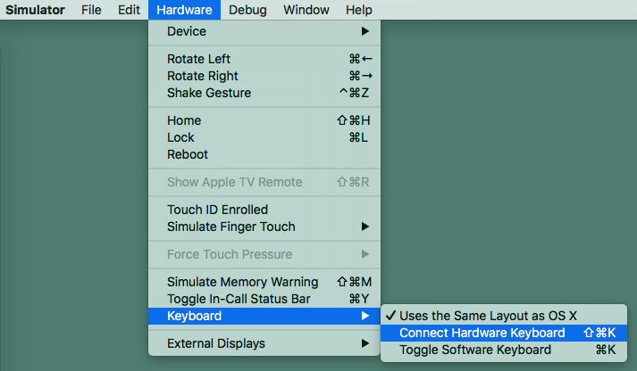
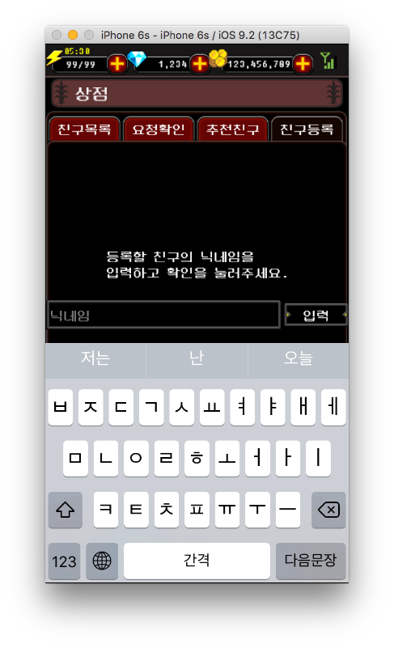

###1. Problem
cocos2d-x TextField,  keyboard is not shown on iOS Simulator.

###2. Solution
- iOS Simulator -> Hardware -> Keyboard
- Uncheck “Connect Hardware Keyboard”

You can see keyboard when you touch TextField area.

